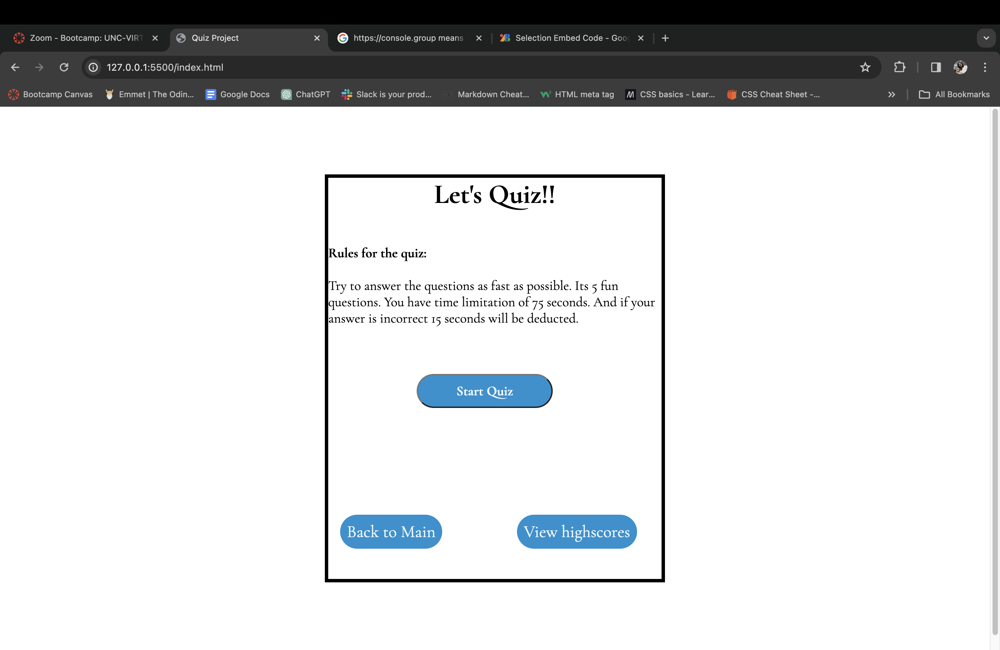
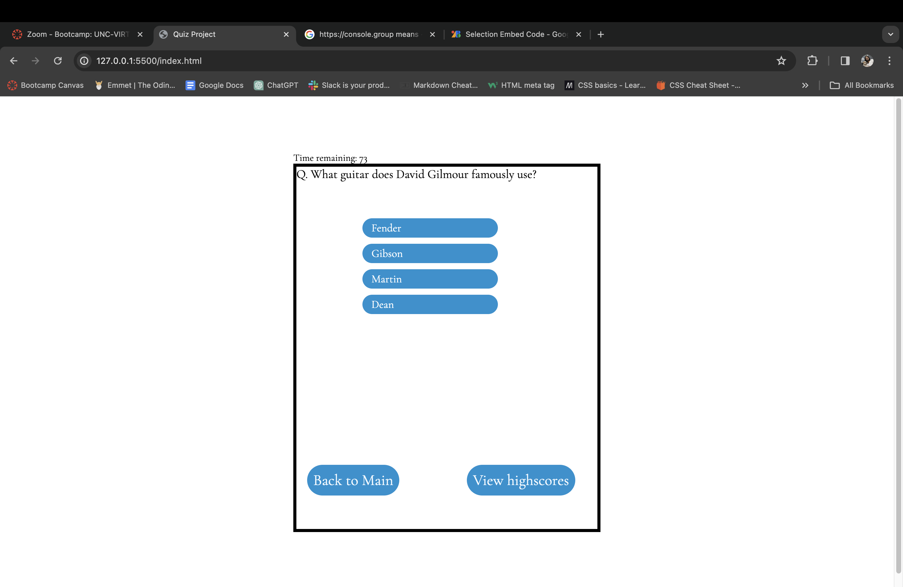
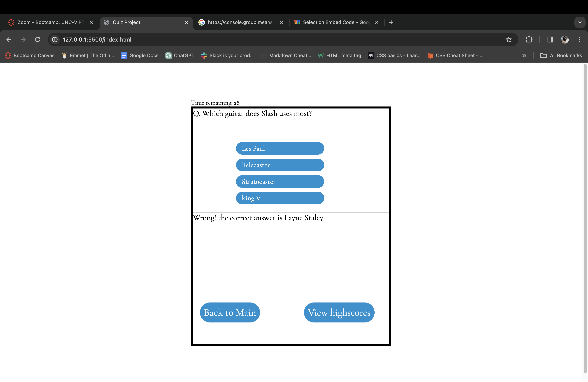
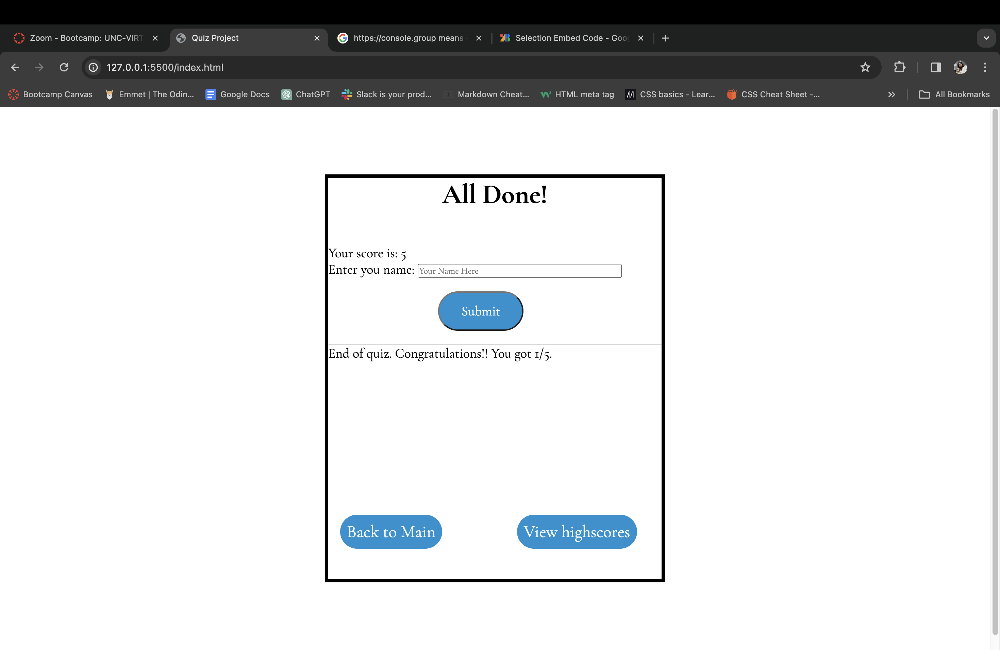
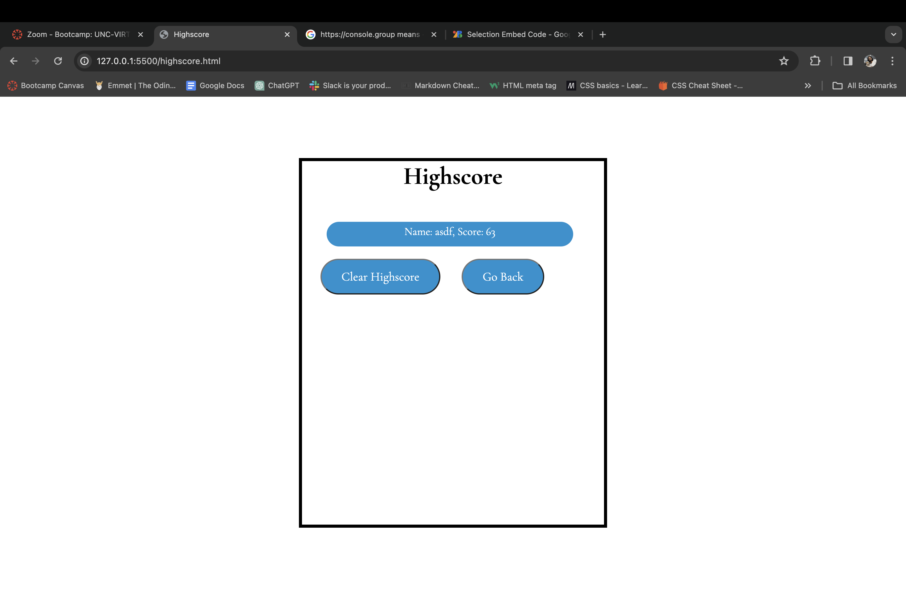

## Quiz Project
# Description
This quiz application is very fun to play. It will ask you five question and you have 75s seconds to complete all the question. If you get the answers wrong you will have penalty time of 15 second. You have five fun questions to answer. Give yourself a try and have fun with the application.

You can play the quiz: [Click here to Quiz]()

Here are some of the screenshots:

# Usage
This application is a fun quiz. In the main page you will have a button to start the quiz. You also have the highscore and back to main page which you can use anytime. For starting the quiz click on the start quiz button. The question will be displayed.
You will have 4 options and 75 seconds total to answer all five questions. Choose answer from 4 options and it will let you know whether the answer is correct or incorrect and also will lead to next question.

After answering all questions, you will reach the last page where score is displayed and you can also save your scores. Just write your name and hit on the submit button. You will also get to page where you can look at the highscores from previous user.
You also do have the option to clear the highscores if you wish to.

# License
&copy; Copyright 2024 Juju Nakarmi